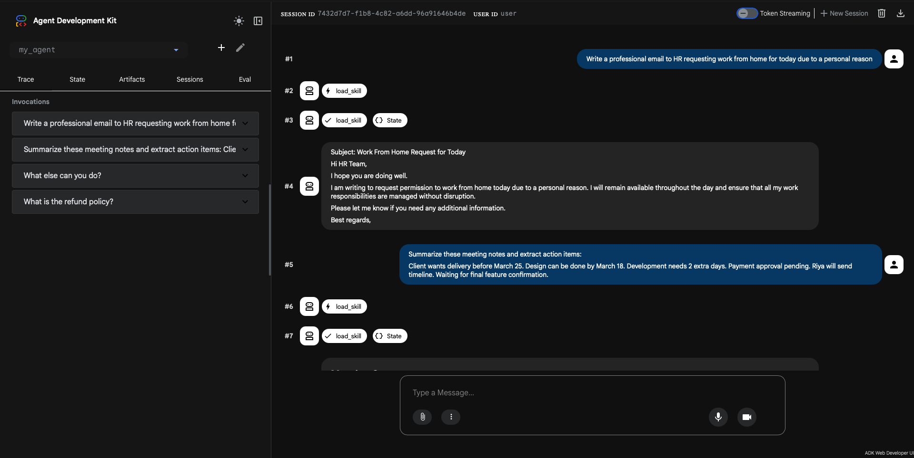

# 🤖 ClientOps Agent

A modular business assistant built using **Google ADK Skills (SKILL.md)**.

ClientOps Agent uses a **multi-skill architecture** where each business task is handled by a focused, reusable skill instead of one large prompt.

---

## 🚀 Overview

ClientOps Agent helps automate common business operations such as:

- ✉️ Writing professional client emails
- 📝 Summarizing meeting notes
- 📋 Generating structured project briefs
- 📖 Answering internal policy questions

Instead of a single monolithic AI prompt, this system uses **file-based ADK Skills**, making it modular, scalable, and easy to extend.

---

## 🧠 Architecture

The system follows a **modular agent + skills design**:

```
User Request
      |
ClientOps Agent (root_agent)
      |
  SkillToolset
      |
  -------------------------
  |        |       |      |
Email  Meeting  Brief  Policy
```

- The **Agent** acts as a decision-maker and router
- Each **Skill** handles one specific task
- Skills are defined using `SKILL.md`

---

## 📁 Project Structure

```
client_ops/
|
├── my_agent/
│   ├── __init__.py
│   └── agent.py
│
├── skills/
│   ├── email-writer/
│   │   ├── SKILL.md
│   │   ├── references/
│   │   └── assets/
│   │
│   ├── meeting-summary/
│   │   ├── SKILL.md
│   │   ├── references/
│   │   └── assets/
│   │
│   ├── brief-generator/
│   │   ├── SKILL.md
│   │   ├── references/
│   │   └── assets/
│   │
│   └── company-policy/
│       ├── SKILL.md
│       ├── references/
│       └── assets/
│
├── assets/
│   └── adk-demo.png
├── requirements.txt
├── .env
├── .gitignore
└── README.md
```

---

## ⚙️ Tech Stack

- Google ADK (Python)
- ADK File-Based Skills (`SKILL.md`)
- SkillToolset
- LiteLLM (OpenAI GPT)
- python-dotenv

---

## 🧩 Skills

### 1. ✉️ Email Writer
- Drafts professional client emails
- Supports follow-ups, updates, reminders, apologies, proposals

### 2. 📝 Meeting Summary
- Converts raw meeting notes into structured summaries
- Extracts:
  - key points
  - decisions
  - action items
  - blockers
  - next steps

### 3. 📋 Brief Generator
- Converts rough project notes into structured project briefs
- Includes:
  - goals
  - scope
  - deliverables
  - timeline
  - risks

### 4. 📖 Company Policy
- Answers internal business questions using reference documents
- Covers:
  - onboarding
  - refunds
  - approvals
  - workflows

---

## 🛠️ Setup

### 1. Clone the repository

```bash
git clone https://github.com/your-username/clientops-agent-adk-skills.git
cd clientops-agent-adk-skills
```

### 2. Create virtual environment

```bash
python -m venv venv
source venv/bin/activate   # Mac/Linux
venv\Scripts\activate      # Windows
```

### 3. Install dependencies

```bash
pip install -r requirements.txt
```

### 4. Create `.env`

```env
OPENAI_API_KEY=your-openai-api-key-here
```

---

## ▶️ Running the Agent

```bash
adk web .
```

Then open [http://127.0.0.1:8000](http://127.0.0.1:8000) in your browser.

### 🖥️ Demo



---

## 💬 Example Prompts

```
Write a follow-up email after a client meeting
```

```
Summarize these meeting notes and extract action items
```

```
Turn these project notes into a structured brief
```

```
What is the refund policy?
```

---

## 🔍 Skill Validation (Recommended)

```bash
agentskills validate ./skills/email-writer
```

---

## 💡 Key Design Principles

- Modular AI architecture
- One skill = one responsibility
- File-based skill definitions (`SKILL.md`)
- Separation of instructions, references, and examples
- Agent handles routing automatically

---

## ⚠️ Limitations

- ADK Skills are currently experimental
- No script execution inside skills
- Skills rely on prompt-based reasoning

---

## 🔮 Future Improvements

- Add RAG-based knowledge for company-policy
- Integrate external APIs (CRM, email, dashboards)
- Add UI for interaction
- Expand skill library
- Multi-agent orchestration

---

## 📌 Summary

ClientOps Agent demonstrates how to build a **real-world modular AI system** using Google ADK Skills.

It shows:

- ✅ Clean architecture
- ✅ Reusable skills
- ✅ Practical business use cases
- ✅ Scalable design pattern

---

## 📄 License

This project is licensed under the MIT License.

You are free to use, modify, and distribute this software with attribution.
See the LICENSE file for full details.

---

## 👤 Author

**Krish Batra**

- 🌐 Website: [https://vybecode.in](https://vybecode.in)
- 📧 Email: [krishatra3@gmail.com](mailto:krishatra3@gmail.com)
- 💼 LinkedIn: [https://www.linkedin.com/in/krish-batra](https://www.linkedin.com/in/krish-batra)
